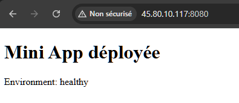
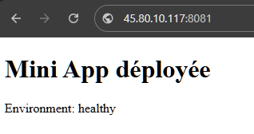
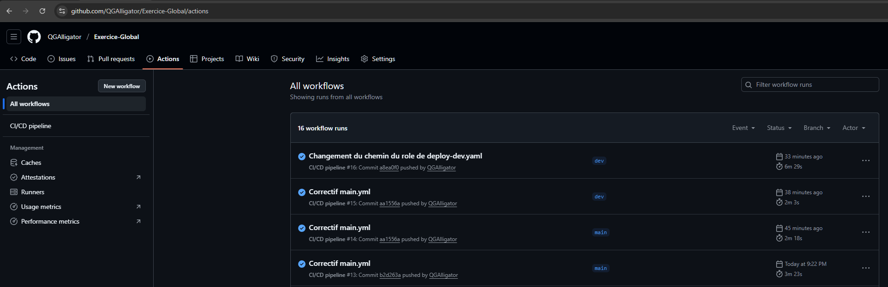

# Exercice Global

Ce dépôt contient l’exercice d’automatisation CI/CD / déploiement avec Ansible, Docker et GitHub Actions.

---

## Table des matières

- [Contexte & objectifs](#contexte--objectifs)
- [Architecture & composants](#architecture--composants)
- [Pré-requis](#pré-requis)
- [Installation & mise en route](#installation--mise-en-route)
  - [Initialisation du dépôt](#initialisation-du-dépôt)
  - [Démarrage des conteneurs Docker](#démarrage-des-conteneurs-docker)
  - [Configuration Ansible & inventaires](#configuration-ansible--inventaires)
  - [Déploiement via playbooks](#déploiement-via-playbooks)
- [CI / GitHub Actions](#ci--github-actions)
- [Validation / tests finaux](#validation--tests-finaux)
- [Captures d’écran](#captures-décran)

---

## Contexte & objectifs

L’objectif de cet exercice est de réaliser une **solution complète de CI/CD** combinant :

- un dépôt Git structuré (branches `main`, `dev`, `feature/*`)
- l’usage de **Docker** pour simuler deux environnements serveurs (dev & prod)
- l’automatisation de déploiement avec **Ansible**
- une pipeline **GitHub Actions** qui déclenche le déploiement en fonction de la branche
- la gestion sécurisée des secrets (clés SSH, mots de passe)
- la validation finale par des tests en condition réelle

---

## Architecture & composants

Voici les principaux éléments :

- `app/` : contenu de l’application (front / back / page de confirmation)
- `ansible/` : les playbooks et inventaires pour dev & prod
- `.github/workflows/pipeline.yml` : définition du workflow CI/CD
- `.gitignore` : pour ne pas versionner les fichiers sensibles
- Branches :
  - `main` → production
  - `dev` → préproduction / test
  - `feature/*` → développement de nouvelles fonctionnalités

---

## Pré-requis

- Docker (version récente)
- Ansible (version compatible avec tes playbooks)
- Accès SSH local (clé privée configurée)
- Compte GitHub avec Secrets configurés (voir plus bas)
- (Optionnel) Python / Node.js ou autre selon l’app dans `app/`

---

## Installation & mise en route

### Initialisation du dépôt

1. Cloner ce dépôt
   ```bash
   git clone https://github.com/QGAlligator/Exercice-Global.git
   cd Exercice-Global
   ```
2. Créer/structurer les branches (si pas encore faites)
   ```bash
   git branch dev
   git checkout main
   ```
3. S’assurer que `.gitignore` est correct (ne versionner ni les clés, ni les logs sensibles)

### Démarrage des conteneurs Docker

Ce dépôt prévoit deux conteneurs Docker :

- **serveur‑dev** — exposé sur le port **2222**
- **serveur‑prod** — exposé sur le port **2200**

Tu dois avoir des Dockerfiles ou des configurations qui :

- installent et configurent un serveur SSH (accès root)
- permettent les connexions par clé (ou mot de passe)

Lance-les (exemples) :

```bash
docker compose up -d
```

ou des commandes Docker classiques :

```bash
docker run -d --name serveur-dev -p 2222:22 ...
docker run -d --name serveur-prod -p 2200:22 ...
```

Vérifie que tu peux te connecter :

```bash
ssh root@<ip serveur docker> -p 2222
ssh root@<ip serveur docker> -p 2200
```

### Configuration Ansible & inventaires

Dans `ansible/` tu dois avoir :

- `inventory/dev.ini`
- `inventory/prod.ini`

Ces fichiers doivent définir :

```ini
[dev]
serveur_dev ansible_host=<ip serveur docker> ansible_port=2222 ansible_user=root ansible_ssh_private_key_file=~/.ssh/id_dev

[prod]
serveur_prod ansible_host=<ip serveur docker> ansible_port=2200 ansible_user=root ansible_ssh_private_key_file=~/.ssh/id_prod
```

(Remplace les chemins, clés, variables selon ta configuration.)

Si tu utilises **Ansible Vault** pour chiffrer des secrets, précise-le dans les fichiers ou dans le playbook principal.

### Déploiement via playbooks

Deux playbooks :

- `deploy-dev.yml`
- `deploy-prod.yml`

Chaque playbook doit :

1. Installer les dépendances nécessaires (git, nginx, node, etc.)
2. Cloner ce dépôt depuis GitHub
3. Construire / lancer l’application (ex: `npm install && npm run build`)
4. Déployer / servir l’application (ex: via nginx ou un simple serveur)
5. Créer une page de confirmation ou logger le résultat

---

## CI / GitHub Actions

Le workflow `.github/workflows/pipeline.yml` doit :

- Se déclencher sur les push vers `dev` ou `main`
- Étapes :
  1. `checkout`
  2. Installer les dépendances (tests, lint, build)
  3. Si branche `dev` → lancer `ansible-playbook deploy-dev.yml`
  4. Si branche `main` → lancer `ansible-playbook deploy-prod.yml`

Secrets nécessaires dans GitHub :

- `DEV_SSH_KEY` → clé privée pour accéder au serveur dev
- `PROD_SSH_KEY` → clé privée pour accéder au serveur prod

---

## Validation / tests finaux

1. Pousser une modification sur `dev` → vérifier que le déploiement sur **serveur-dev** fonctionne
2. Se connecter à `root@<ip serveur docker>:2222` pour voir les logs ou la page de confirmation
3. Fusionner `dev` dans `main` → déclencher le déploiement sur **serveur-prod**
4. Se connecter à `root@<ip serveur docker>:2200` pour vérifier la présence des logs / page
5. Vérifier que les workflows GitHub montrent un statut “success” (vert)

---

## Captures d’écran

- Capture des pages webs qui fonctionnent

  ```md
  
  ```

  ```md
  
  ```

- Capture du workflow GitHub Actions (succès)
  ```md
  
  ```
